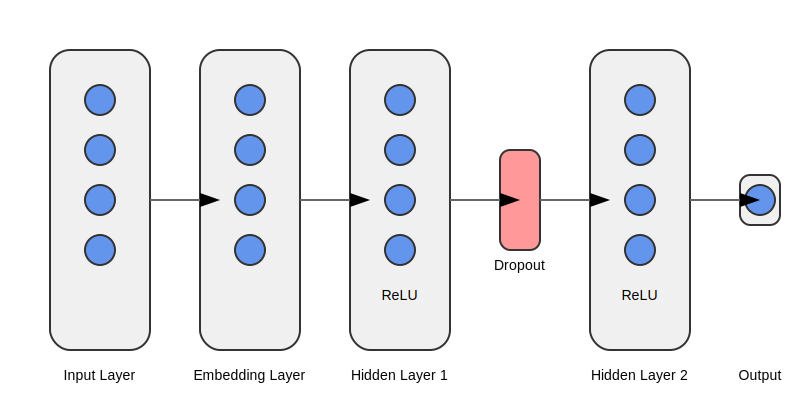

# IMDB Sentiment Analysis with a simple neural network

## Project Overview

This project implements a sentiment analysis model using a simple neural network trained on the IMDB movie review dataset. It demonstrates the process of loading and preprocessing text data, building a basic neural network model, and training it for binary sentiment classification (positive/negative reviews).

## Model Architecture

The sentiment analysis model uses a simple feed-forward neural network with the following structure:



1. Input Layer: Accepts tokenized text input
2. Embedding Layer: Converts tokens to dense vector representations
3. Hidden Layer 1: Fully connected layer with ReLU activation
4. Dropout: Applies dropout for regularization
5. Hidden Layer 2: Fully connected layer with ReLU activation
6. Output Layer: Produces the final sentiment prediction

## Features

- Data loading and preprocessing using the Hugging Face `datasets` library
- Simple neural network model implemented in PyTorch
- Training loop with early stopping and learning rate scheduling


## Setup

1. Clone the repository:
   ```
   git clone https://github.com/yourusername/sentiment-analysis.git
   ```

2. Create a virtual environment (optional but recommended):
   ```
   python -m venv venv
   source venv/bin/activate  # On Windows, use `venv\Scripts\activate`
   ```

3. Install the required dependencies:
   ```
   pip install -r requirements.txt
   ```

## Usage

To train the model with default parameters, simply run:

```
python train_with_simple_nn.py
```

You can customize the training process by passing command-line arguments:

```
python train_with_simple_nn.py --max_length 256 --train_size 25000 --batch_size 64 --embedding_dim 200 --hidden_dim 128 --dropout_rate 0.3 --learning_rate 0.0005 --patience 7
```

## Model Architecture

The sentiment analysis model is a simple feed-forward neural network with the following structure:

1. Embedding layer
2. Two hidden layers with ReLU activation
3. Output layer

Dropout is applied after each hidden layer for regularization.

## Results

After training, the model's performance will be displayed, showing the test accuracy. A plot of the training history (loss and accuracy for both training and validation sets) will be saved as `training_history.png`.

## Future Improvements

- Experiment with more complex architectures (e.g., LSTM, Transformer)
- Implement cross-validation for more robust evaluation
- Add support for loading pre-trained word embeddings
- Extend the model to handle multi-class classification
- Implement a simple web interface for real-time sentiment analysis

## Contributing

Contributions to this project are welcome! Please fork the repository and submit a pull request with your proposed changes.

## License

This project is licensed under the MIT License - see the [LICENSE](LICENSE) file for details.

## Acknowledgments

- The IMDB dataset provided by Stanford AI Lab
- Hugging Face for their `datasets` and `transformers` libraries
- PyTorch team for their excellent deep learning framework

## Contact

For any questions or feedback, please open an issue in the GitHub repository.
